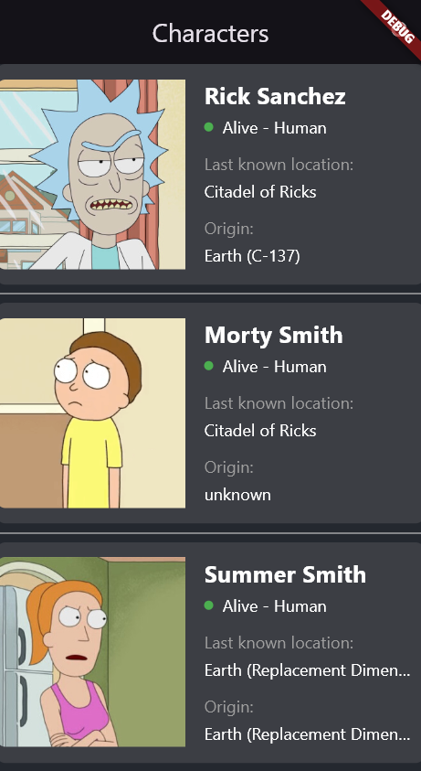
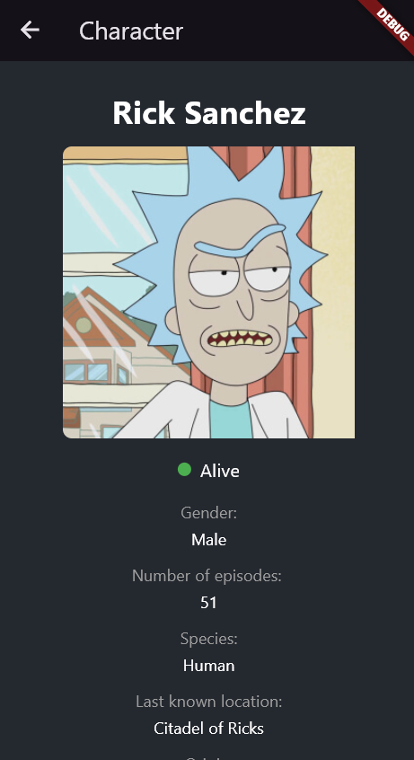
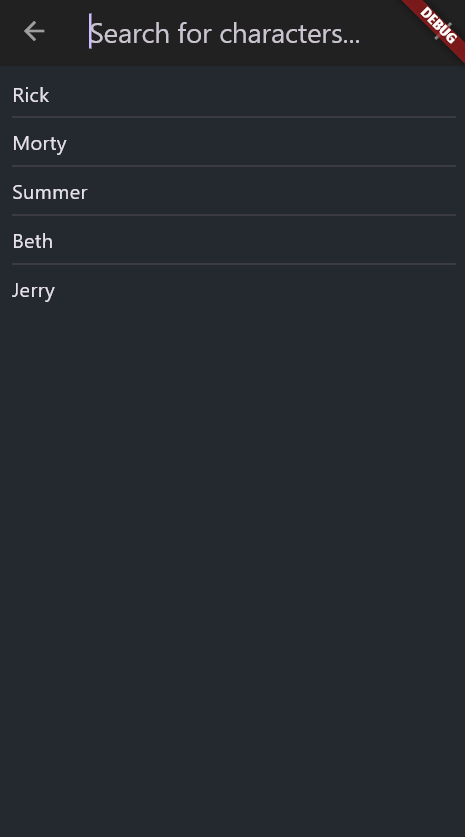

# 🛸 Rick and Morty Flutter App

A **Clean Architecture Flutter application** that displays Rick and Morty characters with search functionality, remote and local data handling, and state management via BLoC and Cubit.

---

## 📱 Screenshots

| Home Screen | Character Detail | Search Screen |
|-------------|------------------|----------------|
|  |  |  |

---

## 📂 Project Structure

lib/
├── common/ # Common UI elements (e.g. colors)
├── core/ # Core logic: error handling, platform services, base usecase
├── feature/ # Feature module
│ ├── data/ # Remote/local sources, models, and repositories
│ ├── domain/ # Entities, abstract repositories, use cases
│ └── presentation/ # UI: BLoC, pages, widgets
├── locator_service.dart # Dependency injection setup
├── main.dart # App entry point

markdown
Копировать
Редактировать

---

## ⚙️ Technologies & Packages

- ✅ **Flutter 3+**
- ✅ **Dart**
- ✅ **BLoC / Cubit**
- ✅ **Clean Architecture**
- ✅ **Dependency Injection** (`get_it`)
- ✅ **Equatable**
- ✅ **Dio / Http**
- ✅ **Cached Network Image**
- ✅ **Local Storage** (`Hive` или `SharedPreferences`) *(уточни, если используешь)*
- ✅ **Network Check** (`NetworkInfo`)

---

## 🚀 Getting Started

### 1. Clone the repository

```bash
git clone https://github.com/maratbeknyazov/rick_and_morty_clean_architecture
cd rick_and_morty_flutter_3
2. Install dependencies
bash
Копировать
Редактировать
flutter pub get
3. Run the app
bash
Копировать
Редактировать
flutter run
💡 Make sure you have Flutter SDK installed and an Android/iOS emulator or real device connected.

🔍 Features
🔁 Load all Rick and Morty characters from the API

🔎 Search characters by name

💾 Caching with local storage (если используешь)

📡 Network check with NetworkInfo

🧱 Clean Architecture separation

🧠 Project Philosophy
Проект построен на Clean Architecture:

presentation не зависит от data

domain — центральное связующее звено

Лёгкое масштабирование и тестирование

🤝 Contributing
Пулл-реквесты приветствуются.
Для крупных изменений, пожалуйста, сначала создайте issue.

📄 License
MIT License. Свободно используйте и модифицируйте.